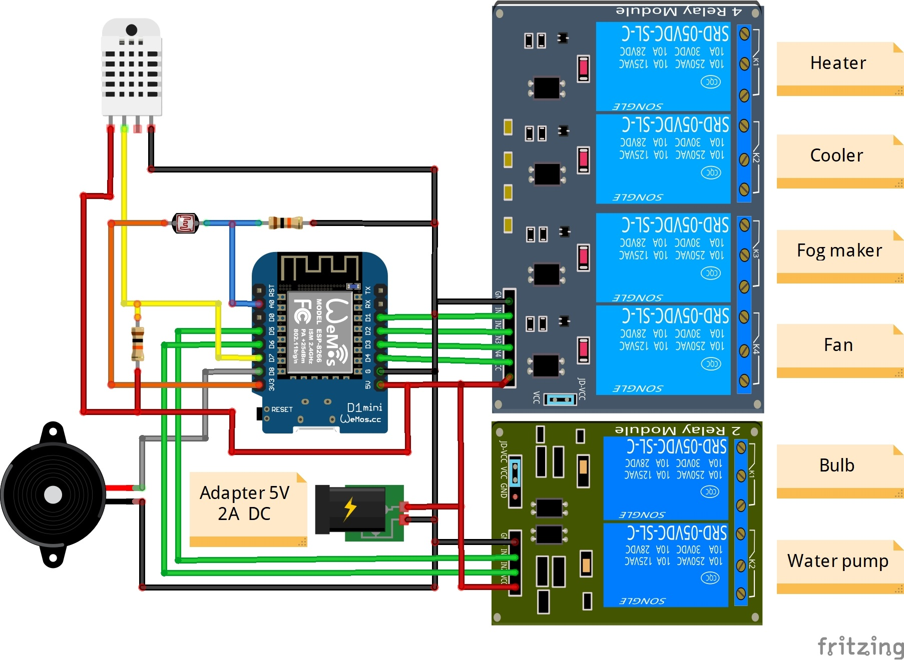

<p align='center'>
    
</p>

## Description:
This middleware can automatically control the temperature and humidity of the greenhouse using the **DHT22** sensor, you will also be able to check the amount of light inside the greenhouse and control the lighting and water pump with your phone. You can install it on the **Nodemcu** and **Wemos D1** development board and easily manage your greenhouse with the least necessary equipment.

## How to use:
1-Download the latest version of the middleware from the [releases](https://github.com/alireza-moshfeghi/Golkhune_ESP8266/releases) section.


2-Install the **CH341** driver on your system from [here](https://github.com/alireza-moshfeghi/Golkhune_ESP8266/blob/main/CH341SER.zip).


3-Download the **Flash download tool** program from [here](https://github.com/alireza-moshfeghi/Golkhune_ESP8266/blob/main/Flash_download_tool.zip). 

4-Connect your development board to the system and apply the following settings.


5-Click on the **START** button and wait for the uploading process to finish.


6-After the middleware is uploaded, restart the development board and connect to the access point of the **Golkhune**.


7-Open your web browser and type the address **192.168.4.1** in the address bar to enter the middleware panel.


## Middleware panel:

<div style='display: flex;'>


</div>

## How to connect:
**Wemos D1 mini:**


**NodeMCU:**


> **Note:** For consumers with coils such as motors, it is better to use a snubber circuit to prevent induced voltage.

<div style='display: flex;'>


</div>

## Necessary equipment:
- Wemos D1 or Nodemcu development board
- DHT22 temperature and humidity sensor
- 4-channel and 2-channel relay module
- Photocell light resistor
- 4.7kΩ and 10kΩ resistor
- Breadboard jumper wire

## Monitor serial commands:
You can use the **status** command to get the temperature, humidity and brightness.
```
Golkhune> status
Temperature: 28°C
Humidity: 53%
Brightness: 67%
Uptime: 26H
Minimum temperature: 25°C
Maximum temperature: 31°C
Minimum humidity: 54%
Maximum humidity: 68%
```

With the **output** command, you can find out the status of the relays.
```
Golkhune> output
Heater: ON
Cooler: OFF
Fog_maker: OFF
Fan: ON
Bulb: OFF
Water_pump: OFF
```

With the **control** command, you can know the status of the bulb and the water pump and turn them on and off by entering the **bulb** and **water_pump** command.
```
Golkhune> control
bulb => OFF
water_pump => ON

Golkhune> bulb
bulb => ON

Golkhune> water_pump
water_pump => OFF
```

Using the **settings** command, you can view the settings stored on the module and change their value by putting the = character at the end of their name.
```
Golkhune> settings
access_point_name: Golkhune
access_point_pass: 
set_min_temperature: 20
set_max_temperature: 30
set_min_humidity: 50
set_max_humidity: 70
delay_time: 10s
temperature_scale: celsius

Golkhune> access_point_name=Greenhouse
Access point name saved successfully.

Golkhune> delay_time=20
Delay time saved successfully.
```

> **Note:** If you have forgotten the password of the access point, you can view it using the **settings** command in the serial monitor.
